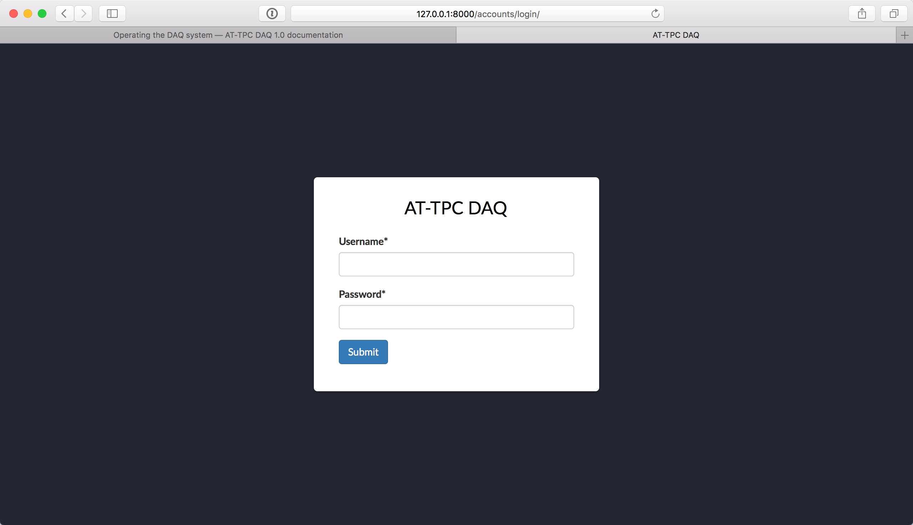
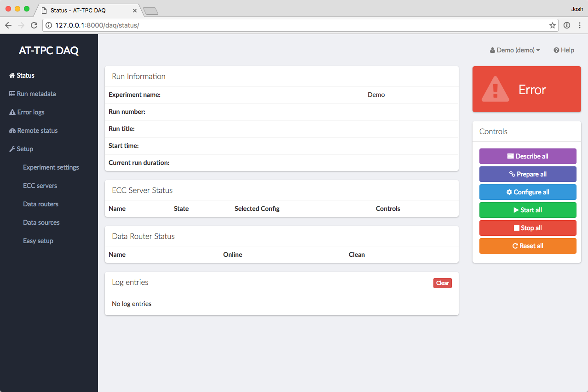

..  _configuration:

Configuring the system
======================

Once everything is up and running, the next step is to tell the DAQ system about the components you'll be using. First,
log into the system. Go to http://localhost:8080 in a browser to get to the main login page:

Sign in using the *experiment* account you created in the last section.

..  note::
    Don't use the superuser account to log in here, or you'll just get an error page. That account should only be used
    to sign into the admin page.

After signing in, you'll find yourself on the main page. If you've just installed the system, it should be blank, like
this:

We need to tell the system about the data routers and ECC servers in the system. That can be accomplished a few
different ways, but the easiest method is to use the Easy Setup page.

..  note::
    Just to be clear, all of the steps on this page are used to set up the *model* of the GET electronics in the DAQ
    GUI. These steps will not start ``getEccSoapServer`` or ``dataRouter`` processes. That must be done separately.
    This section just tells the system where to contact these processes, and we're assuming that they're already
    running and reachable from the network.

Easy setup
----------

On the status page, click the "Easy setup" link in the left-hand menu column. This will take you to a form that you
can fill out to automatically set up the system with some default values. Fill in values for the following fields:

Number of CoBos
    How many CoBos are you using? A data router will be created for each one.
Use one ECC server for all sources?
    If this is checked, the system will create one ECC server and link all CoBos to it. If this is unchecked, a
    separate ECC server object will be created for each CoBo.
IP address of first CoBo ECC server
    If we're using one global ECC server, it will have this IP address. If each CoBo has its own ECC server, the
    first ECC server will get this IP address, and subsequent servers will get this address plus an offset in the
    last segment. For example, if this address is set to ``192.168.1.10``, CoBo 0's ECC server will be at
    ``192.168.1.10``, CoBo 1's ECC server will be at ``192.168.1.11``, CoBo 2's ECC server will be
    at ``192.168.1.12``, etc.
IP address of first CoBo data router
    The address assigned to the data router of the first CoBo. Subsequent CoBos have an address that is incremented
    by an offset like above.
Is there a MuTAnT?
    If so, the system will create a data router object for it.
IP address of the MuTAnT ECC server
    If there is only one global ECC server, the MuTAnT will also be connected to that server, so this field will have
    no effect. Otherwise, the MuTAnT's ECC server will be found at this address.
IP address of MuTAnT data router
    The address where we should look for the MuTAnT data router.

..  note::
    Again, just to be clear, the IP addresses entered here should be the addresses of the computers where the
    ECC server and data router processes are already running.

Once you click "Submit", the system will create all of the necessary objects for this setup.

..  danger::
    Submitting this form will overwrite the current DAQ GUI configuration. This will not destroy any data or config
    files, but it will remove any Data Router, ECC Server, and Data Source objects you've previously configured.

Manual configuration
--------------------

If you need to tweak the results of the easy setup page, or if you need something more sophisticated than what it
provides, you can always set things up manually. Under "Setup" in the left-hand navigation menu, there are links
for setting up ECC servers, data routers, and data sources. Each of these leads to a table of the instances of
that object that are currently set up. You can add a new instance using the "Add" button in the table header, and
instances can be edited or removed using the buttons in each row.

To manually set up the system, you should first create your ECC servers and data routers. Then, create data source
objects to link the two. For more information about the model used to describe the system, see :ref:`models`.