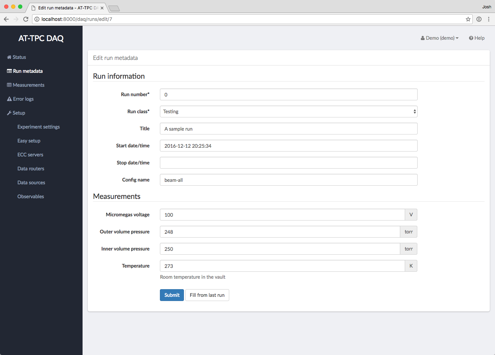

.. _operations:

Operating the DAQ system
========================

At this point, we're nearly ready to take data. This page will describe how to choose a configuration file and
start and stop runs. This is probably the most relevant part of the manual from the point of view of the person
taking an experimental shift.

Web GUI status page
-------------------

After logging into the system at http://localhost:8080 or whatever address the system is available at, you will arrive
at the main status page:

..  image:: images/daq_main.png
    :width: 600 px
    :align: center

This page shows an overview of what's currently happening in the system. It is divided into a set
of panels:

Run Information
    This panel has details about the current current run, like how long it has been going and
    what run number is currently being recorded.

ECC Server Status
    This panel lists the status of each ECC server the system knows about. The "State" indicator
    shows what state machine state the ECC server is in (i.e. "Idle", "Ready", "Running", etc.). The
    "Selected Config" column lists the name of the config file set that will be used to configure the devices.
    he "Controls" column contains a set of buttons for changing the state of an individual ECC server.
    These button should only be used for troubleshooting purposes. Finally, clicking the icon in the "Logs" column
    will display the last few lines of the log file for that ECC server.

Data Router Status
    This panel shows the state of all of the data routers the system knows about. The "Online" column shows if the
    data router process is running, and the "Clean" column shows if the data router's staging directory contains
    unsorted files. Both of these should display green checkmarks if the system is ready to take data.

Log Entries
    This panel will show the latest error messages from the web interface. This does not include
    error messages that may be produced by the GET software. You can click on an individual
    error to get more information and possibly a traceback. Finally, clicking "Clear" will
    discard all error messages.

Controls
    This set of large buttons configures the entire system at once. This is what you should use to
    control the system. The reset button will step the system back one state. For example, if the
    system is in the "Ready" state, pressing Reset will step it back to "Prepared".

Selecting a configuration
-------------------------

Once all necessary processes are up and running, the ECC Server Status panel should display a status of "Idle" for
each ECC server and the Data Router Status panel should show green check marks next to each data router.
At this point, you should select a config file for each ECC server.

Config files can be selected by clicking the pencil icon next to the current config name in the Selected Config
column of the ECC Server Status panel.

..  image:: images/config_column.png
    :width: 600 px
    :align: center

This will bring up a page with a drop-down menu listing the configurations available for that ECC server. The
list of available configurations contains all possible permutations of the set of ``describe-*.xcfg``,
``prepare-*.xcfg``, and ``configure-*.xcfg`` files known to the ECC server. Each configuration is identified by
a name composed of the names of the three ``*.xcfg`` files that go into it, formatted as
``[describe-name]/[prepare-name]/[configure-name]``. For example, if you want to configure a data source using the files
``describe-cobo0.xcfg``, ``prepare-experiment.xcfg``, and ``configure-experiment.xcfg``, then you should choose the
configuration called ``cobo0/experiment/experiment``. See :ref:`config_files` for more information about these files
and their naming convention.

Preparing to take runs
----------------------

After selecting a configuration, the CoBos and MuTAnT must be configured to prepare them to take data. This can be
done using the first three buttons on the main Controls panel.

..  image:: images/prepare_buttons.png
    :width: 200 px
    :align: center

Begin by clicking the "Describe all" button. The system will then send a message to the ECC servers telling them
to execute the "Describe" transition on the CoBos. The status label for each ECC server should then disappear and
be replaced by a spinning cursor. Once the transition is finished, each ECC server should list a status of "Described",
and the overall system status in the top-right corner should also be shown as "Described."

..  note::
    These system-wide buttons only work if *all* ECC servers are in the same state. If they are in different
    states, you will need to use the individual controls in the ECC Server Status panel to bring them into the
    same state.

The next two steps are nearly identical. Click the "Prepare all" button, and wait until the status on each ECC server
is shown as "Prepared." Finally, click "Configure all," and wait for a status of "Ready." At this point, the system
is ready to take data.

..  note::
    If one or more of the CoBos fails to complete the state transition, their ECC servers will remain in whatever state
    they started in. This will be apparent since that ECC server will have a different label from the others, and
    the overall system status in the top-right corner will be shown as "Error." If this happens, look for an
    error message in the "Log entries" panel at the bottom of the page, and try to diagnose the problem.
    Once the problem is fixed, try using the individual controls in the ECC Server Status panel to bring the
    troublesome server to the same state as the others.

Starting a run
--------------

Runs are controlled using the "Start all" and "Stop all" buttons in the main Controls panel.

..  image:: images/start_stop_buttons.png
    :width: 200 px
    :align: center

Once you click "Start all," the CoBos will begin recording data and the Run Information panel should update
to reflect the new run.

..  image:: images/run_info_panel.png
    :width: 600 px
    :align: center

..  danger::
    Data taking on the CoBos can also be started and stopped using the individual source control buttons on the
    ECC Server Status panel; however, if this is done, **the global run number will not be updated**. Therefore, these
    individual buttons should *only* be used in the case of an error where a CoBo fails to start recording data.

Recording run metadata
----------------------

Once a new run has been started, metadata about the run can be entered by clicking on either the "Update values" or
"Same as previous" button on the Run Information panel. Both of these will bring up a form where you can enter
information about the current run. The only difference between the two is that the "Same as previous" button will
pre-fill some fields with their values from the previous run. This is useful for values that don't change often.

Fill in any values on this page that were not filled automatically, and then click "Submit" to save them. You can
get back to the status page by clicking "Status" in the left-hand menu.

..  tip::
    The run will continue even if you navigate away from the status page or close the web browser.

Stopping a run
--------------

When it is time to stop a run, click the "Stop all" button. This will tell the CoBos to stop recording data, and it
will also tell the system to connect to each computer where the data router is running and rearrange the data files
into a directory for the just-completed run. Watch the "Clean" column in the Data Router Status panel to see when
this process has finished.

..  warning::
    It may take several seconds for the data files to be rearranged on each computer. You must wait until
    this process is complete before the system will allow you to start a new run.

Resetting the system
--------------------

When an experiment is complete, or when you want to re-configure the CoBos, the system should be reset to the "Idle"
state. This can be done using the "Reset all" button in the main Controls panel. One click of this button will
step each ECC server back by one state in the state machine (see :ref:`cobo_state_machine`).

..  note::
    Each transition must finish before you click the Reset button again.

