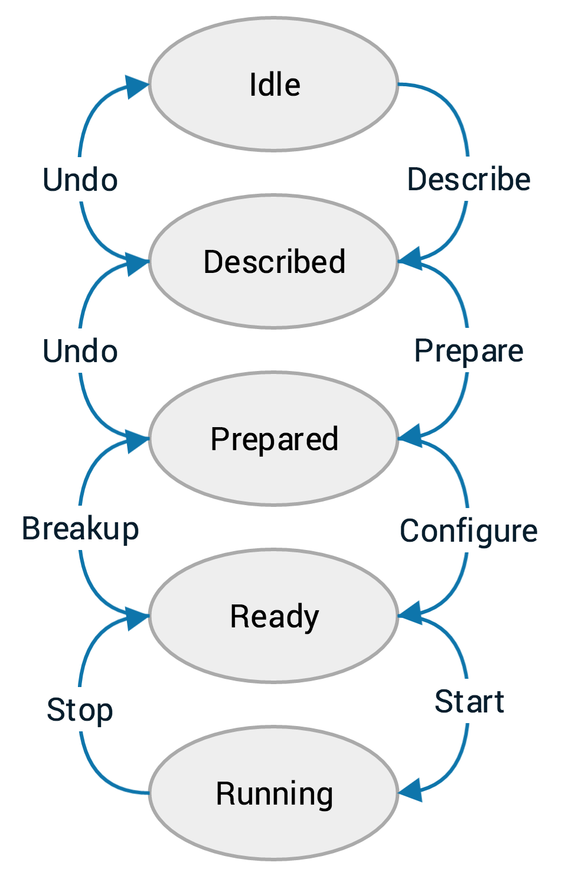

..  _overview:

Overview of DAQ system
======================

The AT-TPC DAQ is based on a collection of programs provided by the GET collaboration. These provide the back-end of the
system by handling CoBo configuration and data recording. This web application serves as a front-end for those programs.

..  _get_software:

GET software components
-----------------------

There are two programs, in particular, that need to be running for each CoBo. They are:

getEccSoapServer
    This program controls the CoBo. It sends the configuration to the CoBo and tells it when to start and stop
    acquisition.

dataRouter
    This program records the data.

The web interface controls the system by acting as a client for the getEccSoapServer. It does not communicate with the
dataRouter directly.

..  _cobo_state_machine:

CoBo state machine
------------------

The ECC server controls the CoBo using the model of a state machine. This means that that CoBo can be in one of several
well-defined *states*, and to change from one state to another, it will undergo a well-defined *transition*. The state
machine for the CoBo looks like this:

The ellipses represent the different states that the system may be in, the arrows along the right side show the
forward state transitions, and the arrows along the left show the reverse state transitions.

..  _config_files:

Config files
------------

Each forward transition requires a particular part of the configuration file. This is why we have three config files
for each setup (or, alternatively, two true files and one symbolic link). The expected files are named:

- ``describe-[name].xcfg`` for the describe step
- ``prepare-[name].xcfg`` for the prepare step
- ``configure-[name].xcfg`` for the configure step

These names will be shown stripped of their prefix and suffix in the DAQ interface. For example, a file called
``describe-cobo0.xcfg`` will be shown as simply ``cobo0``.

Web-based GUI
-------------

The interface to the system is a web application written in Python 3 using the
`Django web framework <https://www.djangoproject.com>`_ for the back-end with `Bootstrap <http://getbootstrap.com>`_
providing the front-end. The structure of the code is described briefly in :ref:`code_docs` and in comments
directly in the code itself.

As Django apps can be a bit tricky to serve, the app has been structured to run inside
`Docker <https://www.docker.com>`_ containers. The Dockerized version of the app can be built using the Docker compose
utility like this:

..  code-block:: shell

    docker-compose build

