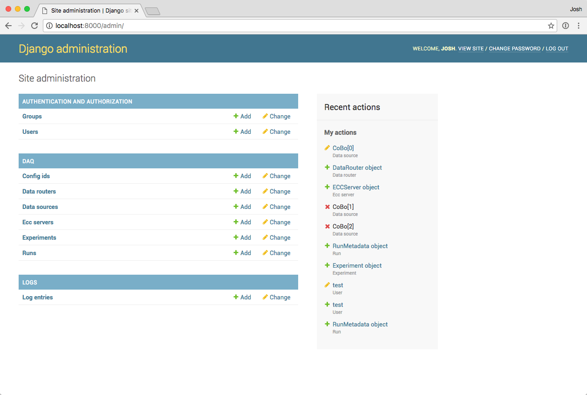
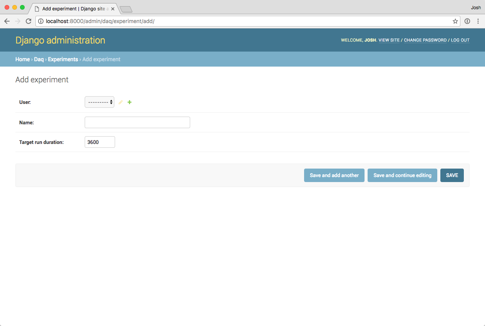

..  _installation:

Installation and initial setup
==============================

Requirements
------------

GET software
~~~~~~~~~~~~

As mentioned :ref:`previously <get_software>`, this DAQ software depends on two of the programs from the GET software
suite: the ``getEccSoapServer`` and the ``dataRouter``. These programs are not provided with this package, so they
must be compiled and installed separately before this package can be installed.

Docker
~~~~~~

Docker and the Docker Compose tool are required to get the containerized version of the DAQ software running. Docker
can be downloaded and installed from `its developers' website <https://www.docker.com/>`_ or from your package manager
if you're using Linux.

Networking
~~~~~~~~~~

If you'll be running the system on multiple computers, be sure to consider where files will be stored. The ECC server
will expect to find config files locally wherever it's running, so if multiple ECC servers are running on multiple
computers, you will likely want to share a folder on your local network to keep the config files in.

Source code
~~~~~~~~~~~

Finally, get the latest version of the DAQ software from GitHub:

..  code-block:: shell

    git clone https://github.com/attpc/attpc-daq.git

Always use the latest version from the Master branch. The version in the Develop branch may not be stable.

Creating the environment file
-----------------------------

There are a few environment variables that need to be set to system-dependent values inside the Docker container.
Several of these variables provide encryption keys or passwords, so this environment file is not in the Git repository
(and it should *never* be committed to the repository!).

Create a file in the root of the repository with the following values. Remove the comment strings (starting with ``#``)
before saving it.

..  code-block:: shell

    DAQ_IS_PRODUCTION=True         # Tells the system to use the production settings, rather than debug.
    POSTGRES_USER=[something]      # A user name for the PostgreSQL database. Set it to something reasonable.
    POSTGRES_PASSWORD=[something]  # A secure, random password that you will not likely need to remember.
    POSTGRES_DB=attpcdaq           # The name of the database for PostgreSQL
    DAQ_SECRET_KEY=[something]     # A secure, *STRONG* random string for Django's cryptography tools.

The user name for PostgreSQL is not important. Just set it to something reasonable. The remaining two things to be
filled in are the PostgreSQL database password and the Django secret key. Set these both to **long**, random strings of
characters since you will not need to remember them.

..  warning::

    Although it may not seem that important to have a strong password on the local network, consider that the Django
    secret key is used to derive everything cryptography-related in the app. This means that it's especially important
    for this key to be both strong and secret.

One way to generate these random strings is the following Python script:

..  code-block:: python

    from __future__ import print_function
    import random

    chars = 'abcdefghijklmnopqrstuvwxyz0123456789!@#$%^&*(-_=+)'
    sr = random.SystemRandom()
    key = ''.join(sr.choice(chars) for i in range(50))
    print(key)

Or, if you prefer a one-liner:

..  code-block:: shell

    python -c "import random; chars = 'abcdefghijklmnopqrstuvwxyz0123456789%^&*(-_=+)'; sr = random.SystemRandom(); print(''.join(sr.choice(chars) for i in range(50)))"

Building the containers
-----------------------

Once you've installed Docker and ``docker-compose``, open a terminal in the root of the repository. This is the
directory with the ``docker-compose.yml`` file. The Docker images can then be built with the command:

..  code-block:: shell

    docker-compose build

This will create a set of Docker images and install all of the software's dependencies inside them. This will require
an internet connection.

Starting the app
----------------

Start all of the containers and the virtual network connecting them by running:

..  code-block:: shell

    docker-compose up

This will instantiate the containers and start them, and then it will start printing the standard output from the
containers. Keep this terminal window running to see the output as the program runs. If you want to quit the program
later, press :kbd:`Control-c` in this terminal.

The first time you run the code, it will need to do some housekeeping to get set up. This may take a minute or so.
When the output printed to the terminal slows down or stops, continue with the next steps.

First-run setup
---------------

When the code is freshly installed, the database that backs the web app will be empty. We need to create a user in
the web app so that we can log in and set up an experiment. To do this, open a new terminal and run this command:

..  code-block:: shell

    docker exec -it attpcdaq_web_1 python manage.py createsuperuser

If we break this command down into parts, it opens a TTY inside the container running the Django app
(``docker exec -it attpcdaq_web_1``) and runs the Django ``manage.py`` script to create a superuser account
(``python manage.py createsuperuser``). It will prompt you for a username and password, which you should choose
and remember for later.

Once you've made a superuser account, open a browser to http://localhost:8080/admin to access the Django
admin interface. Log in with the username and password you just set up. This will put you on the Admin page.

This page allows you to access the internals of the DAQ web interface and directly change the contents of its database.
For now, click on "Experiments" under the "DAQ" header and then click the "Add Experiment" button on the next page.

Click the green plus to add a new regular user account.

..  note::
    Experiments are associated with user names in a one-to-one mapping in this program, so every time you add an
    experiment, you should also create a new experimental user to go along with it.

Also enter a name for the experiment. Data will be written into a directory with this name at the end of each run.
Spaces are ok in this name. Finally, click "Save" to create the experiment.

Once you've finished this, click "Log Out" in the upper right to log out of the admin interface.

Starting the remote processes
-----------------------------

..  note::
    This section assumes the code is running on macOS. Linux distributions support a similar method of configuring
    a process to automatically launch using ``systemd`` services or ``init`` scripts, but that will not be covered
    here.

Under macOS, the remote GET processes are managed by ``launchd``, the operating system's main management process.
It will automatically re-launch the processes if they fail, and it will coordinate logging of the processes' standard
outputs to a log file.

The behavior of ``launchd`` with respect to the GET software components is controlled by a Launch Agent plist file.
Example plist files are included in the Git repository, but here is an annotated example for the ECC server:

..  code-block:: xml

    <?xml version="1.0" encoding="UTF-8"?>
    <!DOCTYPE plist PUBLIC "-//Apple//DTD PLIST 1.0//EN" "http://www.apple.com/DTDs/PropertyList-1.0.dtd">
    <plist version="1.0">
    <dict>
        <!-- A label to identify the program -->
        <key>Label</key>
        <string>attpc.getEccSoapServer</string>

        <!-- Any necessary environment variables. This might include settings for paths
             needed for libraries installed using MacPorts, for example.-->
        <key>EnvironmentVariables</key>
        <dict>
            <key>DYLD_FALLBACK_LIBRARY_PATH</key>
            <string>/opt/local/lib</string>
        </dict>

        <!-- The commands needed to start the program. Each element of the command is given in
             a separate <string> tag. The first element should be the full path to the program,
             and the remaining elements give the command line arguments. -->
        <key>ProgramArguments</key>
        <array>
            <string>/path/to/getEccSoapServer</string>
            <string>--config-repo-url</string>
            <string>/path/to/configs/directory</string>
        </array>

        <!-- The working directory for the program. This is important for the dataRouter as it's
             where that program will write the data. -->
        <key>WorkingDirectory</key>
        <string>/path/to/working/directory</string>

        <!-- Where to write the standard out and standard error files. These may be the same file.
             It is probably best to put the logs in ~/Library/Logs since that will allow you to
             view them with the Console application. -->
        <key>StandardOutPath</key>
        <string>/Users/USER/Library/Logs/getEccSoapServer.log</string>

        <key>StandardErrorPath</key>
        <string>/Users/USER/Library/Logs/getEccSoapServer.log</string>

        <!-- Keep the program running at all times, even if there are no incoming connections. -->
        <key>KeepAlive</key>
        <true/>
    </dict>
    </plist>

A similar file should be created for the data router with the appropriate arguments.

Once plist files have been created, they are conventionally placed in ``~/Library/LaunchAgents``, and they should be
launched on startup if they are in that directory. To launch the programs manually, use ``launchctl``:

..  code-block:: shell

    launchctl load ~/Library/LaunchAgents/attpc.getEccSoapServer.plist

Manually stopping the programs is very similar. Just replace ``load`` with ``unload`` in the above command.

This can also be automated for all of the remote computers using, e.g. Apple Remote Desktop.